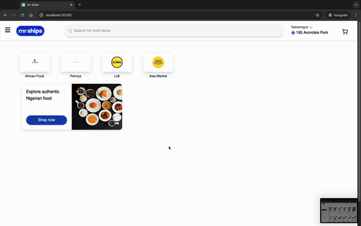

# MrShips - Instacart Clone



## Installation and Running the Project

1. Clone the repository:
   ```bash
   git clone <repository-url>
   cd <repository-directory>
   ```

2. Install the dependencies:
   ```bash
   npm install
   ```

3. Run the application:
   ```bash
   ng serve
   ```

4. Open your browser and navigate to `http://localhost:4200/` to see the app in action.
